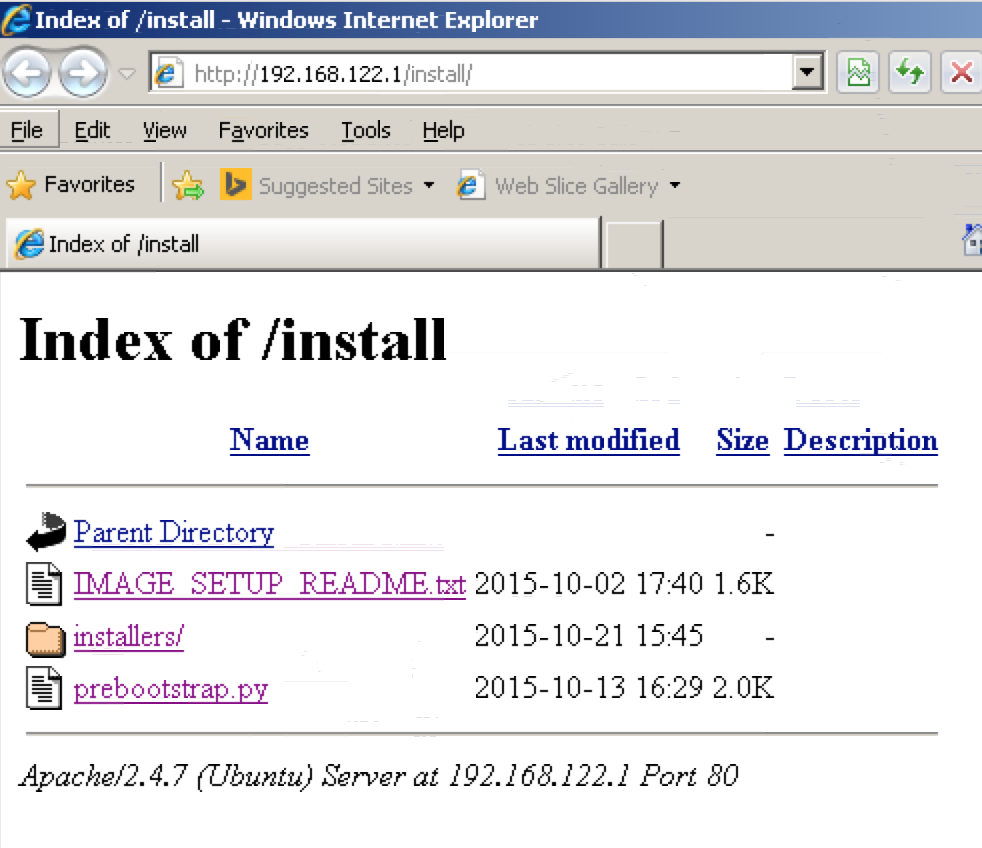

.. _getting_started:
.. _talus_client: https://github.com/optiv-labs/talus_client
.. _Vagrant: https://www.vagrantup.com/
.. _Vagrantfile: https://docs.vagrantup.com/v2/vagrantfile/index.html
.. _cmd: https://docs.python.org/2/library/cmd.html

.. Getting Started
..    Installing the client
..    Creating images
..        from scratch by import (or via iso??)
..        from base image
..    Setting up an image
..    Creating a tool/component
..    Creating a task
..    Creating and running a job/task
..    Job status/info
..    Results
..    Crashes
..    Slave status/info
..    Master status/info

Getting Started
===============

All interactions with Talus are performed through a REST API. Currently the
only UI to talus that uses the REST API is a command line interface:
talus_client_.

Talus Client
------------

The talus_client_ is python-based CLI that uses nested cmd_.Cmd classes to allow the
user to either peform actions interactively, or via command-line flags.

Installation
^^^^^^^^^^^^

The talus_client_ module can be installed globally:

.. code-block:: bash

   pip install --upgrade https://github.com/optiv-labs/talus_client.git@master#egg=talus_client

or locally:

.. code-block:: bash

   pip install --user --upgrade https://github.com/optiv-labs/talus_client.git@master#egg=talus_client

or in a virtual environment (my preferred method):

.. code-block:: bash

   virtualenv path_to_venv
   source path_to_venv/bin/activate
   pip install --upgrade https://github.com/optiv-labs/talus_client.git@master#egg=talus_client
   ...
   # to exit the virtual environment, use the deactivate command
   deactivate

Setup
^^^^^

When running the talus_client_ for the first time you will be prompted to enter
the url where the talus REST API is available, as well as a username that you
would like all models/jobs/images/etc to be tagged with that you create:

.. code-block:: txt

   (venv)zorniger [ talus_client ]: talus
   You don't have a ~/.talusrc. Give me the URL (and port) of the talus master web server.
   E.g. http://some.host.name:55555
   your turn: http://master.talus
   Are you sure the host is 'http://master.talus'? (not a trick question) (y/n): y
   cool
   You also don't have a username. Make one up please (and be reasonable): james
   You want to use 'james' as your username? (y/n) y
   ok, nice to meet you, *quote* james *quote*
   talus>

Information about the location of the talus REST API as well as your "username"
are stored in a :code:`~/.talusrc` json file:

.. code-block:: json

   {"host": "http://master.talus", "user": "james"}

Usage
^^^^^

The talus_client_ is composed of nested cmd_.Cmd modules. All commands can be
performed via command-line flags:

.. code-block:: bash

   talus job create task_1 --priority 80 --limit 1 --debug

Or interactively as shown below. Note that if you want to drop straight into one
of the interactive create shells, use :code:`talus <cmd> create --shell`:

.. code-block:: bash

   (venv)zorniger [ talus_client ]: talus
   talus> job
   talus:job> create
     idx  name                           task.id
   -----  -----------------------------  ------------------------
       0  task_1                         560eaf0f399892009811f19a
       1  task_2                         56297fa9c1d7d2002ccec2f8
       2  task_3                         566a6287a3bfb30003a36918
       3  task_4                         563131d59392d70102b3a321
   
   Which task should the job be based on? (idx or q): 0
   [+]  basing job on task named u'task_1' (560eaf0f399892009811f19a)
   talus:job:create> show
   name        value                                                            description
   ----------  ---------------------------------------------------------------  -------------------------------------------------------------------
   status      {"name": "run"}                                                  Status of the job (don't touch)
   priority    50                                                               Priority of the job (0-100, 100 == highest priority)
   task        560eaf0f399892009811f19a                                         The task the job is based on
   name        task_1 2015-10-29 10:40:39.142128                                The name of the job
   tags        [u'james']                                                       Tags associated with this job
   image       539d8714c3328350080b3df0                                         The image the job should run on
   limit       5                                                                The limit for the task (when does it finish?)
   vm_max      1800                                                             Max vm duration (s) before being forcefully terminated
   queue       jobs                                                             The queue the job should be dripped into (normal use leave blank)
   errors      []                                                               Errors the job has accumulated
   params      {"iters": 3, "arg1": "yoyoyo", "arg2": "yoyoyoyoyoy", "comp1...  Parameters (inherited from the chosen task)
   progress    None                                                             Current progress of the job (don't touch)
   debug       False                                                            If the job should be run in debug mode (logs are always saved)
   timestamps  {}                                                               Timestamps (don't touch)
   logs        []                                                               Debug logs for this job
   network     whitelist                                                        The network whitelist (E.g. 'whitelist:DOMAIN_1,IP_2,DOMAIN_3,...')
   talus:job:create> set priority 80
   talus:job:create> set limit 1
   talus:job:create> set debug True
   talus:job:create> save

Help
^^^^^

All commands in the talus_client_ have a help command that accepts another command
as an argument and will display a (hopefully) helpful help message:

.. code-block:: bash

   (venv)zorniger [ Documents ]: talus image help import
        import   -   Import an image into Talus
   
                     import FILE -n NAME -o OSID [-d DESC] [-t TAG1,TAG2,..] [-u USER] [-p PASS] [-i]
   
                                 FILE    The file to import
                              -o,--os    ID or name of the operating system model
                            -n,--name    The name of the resulting image (default: basename(FILE))
                            -d,--desc    A description of the image (default: "")
                            -t,--tags    Tags associated with the image (default: [])
                         -f,--file-id    The id of an already-uploaded file (NOT A NORMAL USE CASE)
                        -u,--username    The username to be used in the image (default: user)
                        -p,--password    The password to be used in the image (default: password)
                     -i,--interactive    To interact with the imported image for setup (default: False)
   
                     Examples:
   
                     To import an image from VMWare at ``~/images/win7pro.vmdk`` named "win 7 pro test"
                     and to be given a chance to perform some manual setup/checks:
   
                         image import ~/images/win7pro.vmdk -n "win 7 pro test" -i -o "win7pro" -t windows7,x64,IE8

Notes
^^^^^

It should also be noted that current actions in the talus_client_ can be
cancelled with :code:`CTRL-C`. Using the :code:`exit` or similar commands do not
cancel the current action.

Creating Images
---------------

Images are created and configured on the master node via a remote VNC
connection (usually port :code:`59XX`). Vagrant_ is used during the
configuration of images to provide users the flexibility of automatically
configuring the image via a Vagrantfile_ (via a :code:`--vagrantfile` or
:code:`-v` flag in configure, import and create client commands), or to manually
(interactively) configure the image (via a :code:`--interactive` or :code:`-i`
flag).

Creating, importing, or configuring an image without the :code:`-i` flag will
cause the master to shut down and save the VM once the Vagrantfile has finished
running.

From Scratch
^^^^^^^^^^^^

Creating a base image is done via the :code:`talus image import` command:

.. code-block:: bash

   (venv)zorniger [ Documents ]: talus image help import
        import   -   Import an image into Talus
   
                     import FILE -n NAME -o OSID [-d DESC] [-t TAG1,TAG2,..] [-u USER] [-p PASS] [-i]
   
                                 FILE    The file to import
                              -o,--os    ID or name of the operating system model
                            -n,--name    The name of the resulting image (default: basename(FILE))
                            -d,--desc    A description of the image (default: "")
                            -t,--tags    Tags associated with the image (default: [])
                         -f,--file-id    The id of an already-uploaded file (NOT A NORMAL USE CASE)
                        -u,--username    The username to be used in the image (default: user)
                        -p,--password    The password to be used in the image (default: password)
                     -i,--interactive    To interact with the imported image for setup (default: False)
   
To import an image from VMWare at :code:`~/images/win7pro.vmdk` named :code:`win 7 pro test`
and to be given a chance to perform some manual setup/checks:
   
.. code-block:: bash

   talus image import ~/images/win7pro.vmdk -n "win 7 pro test" -i -o "win7pro" -t windows7,x64,IE8

Note that a valid OS id must be supplied, which can be created via :code:`talus
os create`. Existing OS models can be listed via :code:`talus os list`.

To "save" the image, nicely shut down the VM (if it was configured
interactively). The image's status will change to
"ready" once it can be used again.

From a Base Image
^^^^^^^^^^^^^^^^^

It is preferred that base images are kept fairly clean, with minimal
code/programs required to work with talus. Images with specific pre-installed
requirements should be a new image that is based on a clean base image.

.. code:: bash

   (venv)zorniger [ Documents ]: talus image help create
        create   -   Create a new image in talus using an existing base
                     image. Anything not explicitlyspecified will be
                     inherited from the base image, except for the name,
                     which is required.
   
   
                     create -n NAME -b BASEID_NAME [-d DESC] [-t TAG1,TAG2,..] [-u USER] [-p PASS] [-o OSID] [-i]
   
                              -o,--os    ID or name of the operating system model
                            -b,--base    ID or name of the base image
                            -n,--name    The name of the resulting image (default: basename(FILE))
                            -d,--desc    A description of the image (default: "")
                            -t,--tags    Tags associated with the image (default: [])
                              --shell    Forcefully drop into an interactive shell
                     -v,--vagrantfile    A vagrant file that will be used to congfigure the image
                     -i,--interactive    To interact with the imported image for setup (default: False)
   
To create a new image based on the image with id :code:`222222222222222222222222` and adding
a new description and allowing for manual user setup:
   
.. code:: bash

   talus image create -b 222222222222222222222222 -d "some new description" -i

To "save" the image, nicely shut down the VM (if it was configured
interactively). The image's status will change to
"ready" once it can be used again.

(re)Configuring an Existing Image
^^^^^^^^^^^^^^^^^^^^^^^^^^^^^^^^^

Images are allowed to be reconfigured if no images are based on the image that you want to configure.
Both configuration flags apply here was well (:code:`-v` to specify a Vagrantfile and :code:`-i` to
configure the image interactively):

.. code:: bash

   (venv)zorniger [ Documents ]: talus image help configure
     configure   -   Configure an existing image in talus
   
                     configure ID_OR_NAME [-v PATH_TO_VAGRANTFILE] [-i]
   
                           id_or_name    The ID or name of the image that is to be configured (required)
                     -i,--interactive    To interact with the imported image for setup (default: False)
                     -v,--vagrantfile    The path to the vagrantfile that should be used to configure the image (default=None)
   
To configure an image named :code:`Windows 7 x64 Test`, using a vagrantfile found
at :code:`~/vagrantfiles/UpdateIE` with no interaction:

.. code:: bash

   talus image configure "Windows 7 x64 Test" --vagrantfile ~/vagrantfiles/UpdateIE

To "save" the image, nicely shut down the VM. The image's status will change to
"ready" once it can be used again.

Setting up an Image
-------------------

When configuring an image, all VMs should have full network access, including to
the host (master) machine. As part of the install process, the master should
have been setup with an :code:`/install/` directory at the root of its webserver at :code:`http://192.168.122.1/install/`.
The install directory should contain the :code:`prebootstrap.py` and setup
instructions. This would be a good place to put any commonly required
installers/packages, etc. (in the :code:`/talus/install` directory on the master server).

Drivers
^^^^^^^

Images being configured will also have a CDROM mounted containing necessary
libvirt drivers for windows (virtio, ethernet adapters, etc). Be sure to check
device manager on windows and install drivers from the CDROM for any
unrecognized hardware.

Prebootstrap
^^^^^^^^^^^^

Download the prebootstrap.py from `http://192.168.122.1/install/prebootstrap.py <http://192.168.122.1/install/prebootstrap.py>`_
from inside the VM when configuring. The prebootstrap needs to be setup to run
on startup. An easy way to do this is to place a link to the prebootstrap in the
Startup folder.

General Requirements
^^^^^^^^^^^^

Below is a list of other requirements that should be installed/setup in the VM

* no access control (no UAC, passwordless sudo, etc)
* automatic login
* turn off auto-updates
* change appearance/performance to favor performance over appearance
* username/password set to "user/password" (this _can_ be different, but it's easiest to work with the default of user/password)
* Python 2.7 installed and added to the :code:`PATH` environment variable
* pip installed (should come installed by default with the latest versions of Python 2.7.X)
* run :code:`pip install requests pymongo`
* python lxml package (download the installer, don't do this via pip)

Windows Requirements
^^^^^^^^^^^^^^^^^^^^

* sysinternals tools added to sys.path, also with EULA having been agreed to on each exe (mainly need PsExec).
* pip install comtypes
* windbg
* !exploitable (msec.dll)
* VCRedist 2012 x86 and x64 (if applicable)
* WinRM setup:

.. code-block:: bash

   winrm quickconfig -q
   winrm set winrm/config/winrs @{MaxMemoryPerShellMB="512"}
   winrm set winrm/config @{MaxTimeoutms="1800000"}
   winrm set winrm/config/service @{AllowUnencrypted="true"}
   winrm set winrm/config/service/auth @{Basic="true"}
   sc config WinRM start= auto

Also note that all created networks in the VM must be set the “Work”
network. This can be set to be the default action by opening:

#. Open "gpedit.msc"
#. Go to Computer Configration
#. Windows Settings
#. Security Settings
#. Network list manager

Set the appropriate settings to make all networks automatically be marked as a private
(trusted) network.

Tools & Components
------------------

Definitions
^^^^^^^^^^^

Talus is built around the idea that tools written to run inside of VMs should be
highly configurable from a UI. This should prevent the user from having to
re-configure VM images every time dependencies change, and should also keep the
user from having to change their code every time he/she needs to tweak its
operation.

A :code:`Tool` is a user-defined class that is run inside the VM once all dependencies
have been installed. The :code:`run` method on an instantiated tool is run
`once` per vm. Tools must list and document their parameters. Tool
parameters can be any native python type (:code:`str`, :code:`float`,
:code:`int`, etc), a talus :code:`Component`, or a talus :code:`FileSet`

a :code:`Component` is a user-defined class of reusable code. These are intended
to be used by a tool in order to perform utility functions. For example, a debugger
could be a tool, or a web server, or a file downloader. One component could be
written and then reused by multiple different tools. For example, a debugger
component could be written and then used by a browser fuzzer tool, a pdb fuzzing
tools, etc. A :code:`Component` must also document all parameters to its
:code:`init` method, using the same format and types as are required with tool
classes.

A tool that lists a component as a parameter will be passed an instantiated
component of the specified type.

One of the major benefits of this setup is that users can use polymorphism with
their components. Back to the debugger example, a generic IDebugger interface
could be created that exposes certain functionality/methods. Specific debugger
implementations could then subclass the IDebugger component to provide
specific functionality (e.g. separate debuggers for Windows, Linux, and Mac). Tools that require
a debugger could then set the type of their debugger parameter to an IDebugger
component. When configuring the tool to be run, the user will then be able to
choose which specific class to use (the windows debugger, linux, or mac
debugger).

Separating components from tools allows tools to perform actions without needing
to know the configuration details.

Examples
^^^^^^^^

The documented parameters in tools and components are parsed out of the source
code and validated in a pre-receive hook in the talus master git repository.
Useful error messages should be returned if invalid parameters are specified.

Below is a :code:`TestTool` class that accepts four parameters -
two strings, an integer, and a component:

.. code-block:: python

    from talus.tools import Tool

    class TestTool(Tool):
        """This is a description for the TestTool
        """

        def run(self, arg1, arg2, comp1, iters):
            """Run the Template tool with a few args and a component

            :param str arg1: The first argument (a string)
            :param str arg2: The second argument (a string)
            :param int iters: The number of times to report progress
            :param Component(ComponentTemplate) comp1: The third argument (an instantiated Template component)
            """
            for x in xrange(iters):
                comp1.do_sometheing(arg1, arg2)
                self.progress(1)

Notice how the parameters are documented within the docstring. These parameters
are directly used to configure the Tool before it is run inside the VMs. Below
is an example of configuring the test tool above using the talus_client_:

.. code-block:: bash

    talus:job:create> set params

    Editing params

    talus:job:create:params> show
    name    type               value                                         description
    ------  -----------------  --------------------------------------------  -------------------------------------------------------
    arg1    str                None                                          The first argument (a string)
    arg2    str                None                                          The second argument (a string)
    iters   int                None                                          The number of times to report progress
    comp1   ComponentTemplate  (ComponentTemplate) {u'prefix': None}         The third argument (an instantiated Template component)

Git Repo
^^^^^^^^

All tools and components that are to be run through talus must exist in the git
repository found on the talus master server. Users can clone the git repository
like so:

.. code-block:: bash

    git clone git+ssh://USER@TALUS_MASTER/talus/talus_code.git

:code:`USER` should be your username on the talus master server. Users need to be a member of
the :code:`talus` group in order to clone the code repository.

Creating New Code
^^^^^^^^^^^^^^^^^

Code can manually be manually created by creating a new tool/component folder in the
:code:`talus/tools` or :code:`talus/components` folder. The name of the tool's
directory must be the underscore-cased equivalent of the pascal-cased class name
(confusing, I know). For example, the :code:`TestTool` class must exist in an
:code:`__init__.py` file in the :code:`talus/tools/test_tool/` directory.

This can also be performed through the talus_client_ using the :code:`code create` comamnd:

.. code-block:: bash

    create   -   Create new code in the repository. This will create
                  the code in the talus repository, as well as in the
                  database.

                  code create NAME -t or -c

                       -t,--tool    Create a tool
                  -c,--component    Create a component

The example below will cause a new tool name :code:`DemoTool` to be created in the git repository:

.. code-block:: bash

   talus code create -t DemoTool

After running the above command, users should see their newly-created tool when
they pull remote changes to the git repository:

.. code-block:: bash

    (venv)zorniger [ talus_client ]: talus code create -t DemoTool
    [.]  git pull to see your new tool
    (venv)zorniger [ talus_client ]: cd /tmp/talus_code/
    (venv)zorniger [ talus_code ]: git pull
    remote: Counting objects: 10, done.
    remote: Compressing objects: 100% (7/7), done.
    remote: Total 7 (delta 3), reused 0 (delta 0)
    Unpacking objects: 100% (7/7), done.
    From git+ssh://master.talus/talus/talus_code
       300d128..a8c01ee  master     -> origin/master
    Updating 300d128..a8c01ee
    Fast-forward
     talus/tools/demo_tool/__init__.py      | 61 +++++++++++++++++++++++++++++++++++++++++++++++++++++++++++++
     talus/tools/demo_tool/requirements.txt |  1 +
     talus/tools/demo_tool/run_local.py     | 14 ++++++++++++++
     3 files changed, 76 insertions(+)
     create mode 100644 talus/tools/demo_tool/__init__.py
     create mode 100644 talus/tools/demo_tool/requirements.txt
     create mode 100644 talus/tools/demo_tool/run_local.py

Creating a Task
---------------

Tasks can be thought of as templates that contain default settings for running a tool. Tasks
are created through the talus client either interactively, or through command-line parameters:

.. code-block:: bash

     create   -   Create a new task in Talus

                  create -n NAME -t TOOL_ID_OR_NAME -p PARAMS -l LIMIT

                          -n,--name    The name of the new task (required, no default)
                          -t,--tool    The name or id of the tool to be run by the task (required, no default)
                         -l,--limit    The limit for the task. What the limit means is defined by how the tool
                                       reports progress. If the tool does not report progress, then the limit
                                       means the number of total VMs to run.
                           --vm-max    Maximum amount of time a vm should be allowed to run (defaults to 30m)
                                       You may use values such as 30m15s. If no units are used, the value is
                                       assumed to be in seconds.
                        -p,--params    The params of the task
                            --shell    Create the task in an interactive shell (default if already in shell and no args)
                       -v,--version    The version the task should be pinned at, else the current HEAD (default=None)
                   -f,--params-file    The file that contains the params of the task

To create a new task that uses the tool "BrowserFuzzer":

.. clode-block:: bash

    task create -n "IE Fuzzer" -t "BrowserFuzzer" -p "{...json params...}"

To create a new task that also uses the "BrowserFuzzer" tool but reads in the params
from a file and has a max vm runtime of 45 minutes 10 seconds:

.. code-block:: bash

    task create -n "IE Fuzzer" -t "BrowserFuzzer" -f ie_fuzz_params.json --vm-max 45m10s

Note that using command-line options to set the default paramters for tools and
components is very unwieldy and extremely tedious. It is HIGHLY recommended that
you use the interactive mode to create tasks instead:

.. code-block:: bash

    (venv)zorniger [ talus_code ]: talus
    ttalus> task
    talus:task> create
    talus:task:create> show
    name        value       description
    ----------  ----------  --------------------------------------------------------------------
    version     None        The version of code the task should run on (leave blank for default)
    params      {}          The parameters for the tool
    name                    The name of the task
    tags        [u'james']  Tags associated with this task
    timestamps  {}          Timestamps (don't mess with this)
    tool        None        The tool the task should run
    limit       1           Limit for the task (when does it finish?)
    image       None        The default image for this task
    vm_max      1800        Max vm duration (s) before being forcefully terminated
    network     whitelist   The network whitelist (E.g. 'whitelist:DOMAIN_1,IP_2,DOMAIN_3,...')
    talus:task:create> set name "the name of the task"

Tasks can be listed using the :code:`talus task list` command.

Creating and Running a Job
--------------------------

Jobs are instances of a task that have been run. Job parameters should never be
edited, as they preserve the state that the job was run under (to help with
reproducibility, etc.)

Creating a job is nearly identical to creating a task, and can be done through
both the command-line and interactive modes. If no changes to the default
task settings need to be made, all that must be provided to run a job is the
task name or id.

.. code-block::

   talus job create test_task --debug --limit 1

An optional :code:`--debug` flag exists when creating a job. This will cause the
master daemon to spin up at most :code:`--limit` VMs, and will also cause all
messages logged in the tool via :code:`self.log.{debug,info,error,warn,etc}` to
be saved to the database.

Limit and Progress
^^^^^^^^^^^^^^^^^^

The limit attribute on a job determines when a job will be finished. The limit
can be any positive integer or -1. A value of -1 means that the job will run
forever until the user cancels the job.

By default, if a successfully run tool did not explicitly increment the job's
progress via :code:`self.progress()`, the job's overall progress is
automatically incremented by 1. For example, tools may choose to increment the job's progress for
every 100 iterations of a fuzzer by doing something similar to:

.. code-block:: python

    def run(self, ...):
        """...
        """
        count = 0
        for x in xrange(iters):
            count += 1
            if x % 100 == 0:
                self.progress(count)
                count = 0
            self.perform_iteration()
        # report any unreported iterations
        self.progress(count)
 
This will allow the user to treat the :code:`--limit` of the job as total number
of iterations required. Talus will continue to spin up as many VMs as possible (according
the job's priority) until the limit has been reached.

Priorities
^^^^^^^^^^

A job may also have a priority. Priority values can be anything between 0 and
100. The master daemon maintains a priority queue that it uses to add batches of
job parts into the jobs queue when the queue is empty. This allows one job to
preempt other lower-piority jobs. This also allows users to start never-ending
jobs that can run with an extremely low priority.

Job Status/Info
---------------

A job's status, current speed (how many progress increments/time), overall
progress, and details of currently-running VMs for that job can be viewed using
the :code:`talus job info` command:

.. code-block:: bash

       info   -   List detailed information about the job.

                  Git-like syntax can also be used here to refer to the most recently created
                  job. E.g. the command below will show info about the 2nd most recent job:

                      job info +2

                  Search information can also be used. If git-like syntax is omitted, only
                  the first entry returned from the database will be displayed.

                      job info --all --status running --sort -priority +2

                  The example above will show information about 2nd highest priority job whose
                  status is running. Omitting --all will cause the search to be performed only
                  among _your_ jobs.

Below is an example of output from the job info command:

.. code-block:: bash

    (venv)zorniger [ talus_client ]: talus job info +1
    [+]  default filtering by username (searching for tags = james)
    [+]  use --all to view all models

             ID: 5633c7808fa3e20018c34afc
           Name: test_task 2015-10-30 14:39:44.111238
         Status: running
           Tags: [u'james', u'']
        Started: seconds ago (2015-10-30 14:39:44)
          Ended:
          Debug: False
          Speed: 0.0/s, 0.0/min, 0.0/hour, 0.0/day
       Progress: 0.0% (0 / 20)
           Task: crash_test_task (560eaf0f39489200081ff19a)
       Priority: 50
         Params: {"iters": 3, "arg1": "yoyoyo", "arg2": "yoyoyoyoyoy", "comp1": {"params": {"prefix": "blahblah"}, "class": "ComponentTemplate"}}
        Network: whitelist
          Image: win7 (563d827413a25300090faa02)
         VM Max: 1800
    Running VMS:

    slave           vnc port  running since      job idx  status        |  slave           vnc port  running since      job idx  status
    ------------  ----------  ---------------  ---------  ------------  |  ------------  ----------  ---------------  ---------  --------
    slave.talus2        5948  seconds ago              1  running tool  |  master.talus        5919  seconds ago              2  booting
    slave.talus2        5949  seconds ago              3  running tool  |  master.talus        5915  seconds ago              6  booting
    slave.talus2        5912  seconds ago              5  running tool  |  master.talus        5907  seconds ago             11  booting
    slave.talus2        5901  seconds ago             10  running tool  |  master.talus        5900  seconds ago             14  booting
    slave.talus2        5902  seconds ago             13  running tool  |  master.talus        5910  seconds ago             15  booting
    slave.talus2        5913  seconds ago             19  running tool  |  slave.talus1        5940  seconds ago             24  booting
    slave.talus2        5903  seconds ago             21  running tool  |  slave.talus1        5939  seconds ago             30  booting
    slave.talus2        5909  seconds ago             23  running tool  |  slave.talus1        5930  seconds ago             36  booting
    slave.talus3        5910  seconds ago             26  running tool  |  slave.talus1        5941  seconds ago             40  booting
    slave.talus3        5917  seconds ago             27  running tool  |  slave.talus1        5938  seconds ago             41  booting
    slave.talus3        5918  seconds ago             29  running tool  |  slave.talus1        5926  seconds ago             59  booting
    slave.talus3        5907  seconds ago             32  running tool  |  slave.talus1        5924  seconds ago             69  booting
    slave.talus3        5919  seconds ago             35  running tool  |  slave.talus1        5922  seconds ago             70  booting
    slave.talus3        5920  seconds ago             39  running tool  |  slave.talus1        5925  seconds ago             72  booting
    slave.talus3        5906  seconds ago             46  running tool  |  slave.talus1        5933  seconds ago             73  booting
    slave.talus3        5905  seconds ago             48  running tool  |  slave.talus2        5929  seconds ago             75  booting
    slave.talus3        5914  seconds ago             49  booting       |  slave.talus2        5942  seconds ago             76  booting
    slave.talus3        5911  seconds ago             52  running tool  |

Results
-------

Adding
^^^^^^

Results are added from a tool by using the :code:`self.result(TYPE, DATA)` method. This cause the result of type
`TYPE` to be added to the database. Information about the job, tool, timestamps, etc will be automatically
added to the result in the database.

For example, to save data about a crash, you would set the type to :code:`"crash"`, and add the crash information
as the data parameter:

.. code-block:: python

    class CrashTestTool(Tool):
        """...
        """
        file_id = self.add_file(
            "REPRO DATA",
            content_type="application/json",
            filename="this_was_the_filename.json"
        )
        self.result("crash", {
            "registers": {
                "eip": int(random.random() * 0xffffffff),
                "eax": int(random.random() * 0xffffffff),
                "ecx": int(random.random() * 0xffffffff),
                "edx": int(random.random() * 0xffffffff),
                "ebx": int(random.random() * 0xffffffff),
                "esp": int(random.random() * 0xffffffff),
            },
            "backtrace": [
                
            ],
            "disassembly": [
                "0000fff0 int 3",
                "0000fff1 int 3",
                "0000fff2 int 3",
                "--> 0000fff3 {}".format(random.choice(["jmp eax", "mov eax,[ecx+12]", "ret", "call [ebx]", "lea ecx,[eax+1080]"])),
                "0000fff4 ret",
            ],
            "hash_major": random.choice(["bucket1", "bucket2", "bucket3"]),
            "hash_minor": random.choice(["minor_bucket1", "minor_bucket2", "minor_bucket3"]),
            "exploitability": random.choice(["EXPLOITABLE", "NOTEXPLOITABLE", "UNLIKELY"]),
            # a list of files for reproducing the bug
            "repro": [
                file_id,
            ],
        })

Listing
^^^^^^^

Results can be listed using the :code:`talus result list` command. Standard search
queries can be used, as with all other search methods:

.. code-block:: bash

    (venv)zorniger [ talus_client ]: talus result list --job 563117bd9392d70008b30324 --num 10 --tags result_test
    [+]  searching for job = 563117bd9392d70008b30324
    [+]  searching for num = 10
    [+]  searching for tags = result_test
    [+]  default filtering by username (searching for tags = james)
    [+]  use --all to view all models
    id                        tags                        type    tool           created                     job                       data
    ------------------------  --------------------------  ------  -------------  --------------------------  ------------------------  ----------------------------------------
    563118cfd8fb8d38907eec7e  [u'james', u'result_test']  crash   CrashTestTool  2015-10-28T12:49:51.740000  563117bd9392d70008b30324  {u'backtrace': [], u'repro': [u'56317b33
    563118c6d8fb8d38907eec75  [u'james', u'result_test']  crash   CrashTestTool  2015-10-28T12:49:42.759000  563117bd9392d70008b30324  {u'backtrace': [], u'repro': [u'56317b30
    563118c6d8fb8d38907eec74  [u'james', u'result_test']  crash   CrashTestTool  2015-10-28T12:49:42.478000  563117bd9392d70008b30324  {u'backtrace': [], u'repro': [u'56317b2b
    563118c0d8fb8d38907eec6d  [u'james', u'result_test']  crash   CrashTestTool  2015-10-28T12:49:36.671000  563117bd9392d70008b30324  {u'backtrace': [], u'repro': [u'56317b26
    563118bdd8fb8d38907eec69  [u'james', u'result_test']  crash   CrashTestTool  2015-10-28T12:49:33.002000  563117bd9392d70008b30324  {u'backtrace': [], u'repro': [u'56317b29
    563118b6d8fb8d38907eec62  [u'james', u'result_test']  crash   CrashTestTool  2015-10-28T12:49:26.817000  563117bd9392d70008b30324  {u'backtrace': [], u'repro': [u'56317b20
    563118b0d8fb8d38907eec5c  [u'james', u'result_test']  crash   CrashTestTool  2015-10-28T12:49:20.540000  563117bd9392d70008b30324  {u'backtrace': [], u'repro': [u'56317b1c
    563118afd8fb8d38907eec59  [u'james', u'result_test']  crash   CrashTestTool  2015-10-28T12:49:19.486000  563117bd9392d70008b30324  {u'backtrace': [], u'repro': [u'56317b1a
    563118acd8fb8d38907eec55  [u'james', u'result_test']  crash   CrashTestTool  2015-10-28T12:49:16.318000  563117bd9392d70008b30324  {u'backtrace': [], u'repro': [u'56317b17
    563118aad8fb8d38907eec52  [u'james', u'result_test']  crash   CrashTestTool  2015-10-28T12:49:14.802000  563117bd9392d70008b30324  {u'backtrace': [], u'repro': [u'56317b16

Crashes
-------

A crash-specific result-type command can be used to view crashes, crash details, and export crash
data.

Listing
^^^^^^^

Listing crashes is performed with the :code:`talus crash list` command:

.. code-block:: bash

   list   -   List crashes in talus. Fields to be searched for
              must be turned into parameter format (E.g.
              ``--search-item "some value"`` format would search

              for a result with the field ``search_item`` equaling ``some value``).

              Examples:
                  crash list --search-item "search value" [--search-item2 "search value2" ...]
                  crash list --registers.eip 0x41414141
                  crash list --all --tags browser_fuzzing
                  crash list --exploitability EXPLOITABLE
                  crash list --\$where "(this.data.registers.eax + 0x59816867) == this.data.registers.eip"

Below is a simple example of using the :code:`crash list` command:

.. code-block:: bash

    (venv)zorniger [ talus_client ]: talus crash list --tags result_test --num 10
    [+]  searching for tags = result_test
    [+]  searching for num = 10
    [+]  default filtering by username (searching for tags = james)
    [+]  use --all to view all models
    id                        tool           created     exploitability    hash                   instr               registers
    ------------------------  -------------  ----------  ----------------  ---------------------  ------------------  -------------------------
    563118cfd8fb8d38907eec7e  CrashTestTool  2 days ago  EXPLOITABLE       bucket3:minor_bucket3  ret
    563118c6d8fb8d38907eec75  CrashTestTool  2 days ago  EXPLOITABLE       bucket2:minor_bucket1  call [ebx]          ebx:227faccc
    563118c6d8fb8d38907eec74  CrashTestTool  2 days ago  UNLIKELY          bucket2:minor_bucket2  lea ecx,[eax+1080]  eax:4a358661 ecx:24f6c0d8
    563118c0d8fb8d38907eec6d  CrashTestTool  2 days ago  EXPLOITABLE       bucket2:minor_bucket1  jmp eax             eax:a5a76cb6
    563118bdd8fb8d38907eec69  CrashTestTool  2 days ago  NOTEXPLOITABLE    bucket3:minor_bucket3  ret
    563118b6d8fb8d38907eec62  CrashTestTool  2 days ago  NOTEXPLOITABLE    bucket1:minor_bucket2  mov eax,[ecx+12]    eax:ba014e3e ecx:607ce892
    563118b0d8fb8d38907eec5c  CrashTestTool  2 days ago  NOTEXPLOITABLE    bucket3:minor_bucket3  call [ebx]          ebx:b32b4d80
    563118afd8fb8d38907eec59  CrashTestTool  2 days ago  UNLIKELY          bucket2:minor_bucket1  mov eax,[ecx+12]    eax:a7bf6d02 ecx:a963a5f7
    563118acd8fb8d38907eec55  CrashTestTool  2 days ago  NOTEXPLOITABLE    bucket2:minor_bucket1  jmp eax             eax:e8a66627
    563118aad8fb8d38907eec52  CrashTestTool  2 days ago  NOTEXPLOITABLE    bucket2:minor_bucket3  call [ebx]          ebx:56cf65d3

Info
^^^^

Crash info can be dumped using the :code:`talus crash info` command. If you want to see *all* details
of a crash, add the :code:`--details` flag:

.. code-block:: bash

       info   -   List detailed information about the crash.

                  Git-like syntax can also be used here to refer to the most recently created
                  crash result. E.g. the command below will show info about the 2nd most recent crash:

                      crash info +2

                  Search information can also be used. If git-like syntax is omitted, only
                  the first entry returned from the database will be displayed.

                      crash info --all --registers.eip 0x41414141 --sort registers.eax +1

                  The example above will show information about the crash with the lowest eax value
                  (+2 would show the 2nd lowest) that has an eip 0f 0x41414141.  Omitting --all will
                  cause the search to be performed only among _your_ crashes.

                  To view _all_ of the details about a crash, add the --details flag.

Below is the output of a real example of viewing crash info:

.. code-block:: bash

    (venv)zorniger [ talus_client ]: talus crash info --tags result_test +2
    [+]  searching for tags = result_test
    [+]  default filtering by username (searching for tags = james)
    [+]  use --all to view all models

                  ID: 563118c6d8fb8d38907eec75
                 Job: james_test_test9 (563117bd9392d70008b30324)
      Exploitability: EXPLOITABLE
    Hash Major/Minor: bucket2 minor_bucket1
         Crash Instr: call [ebx]
        Crash Module:
      Exception Code:        0

              -------------------  |  ---  --------  |  ---  --------
              0000fff0 int 3       |  eip  e05576cf  |  edx  c77df43e
              0000fff1 int 3       |  esp  7ad6c630  |  ebx  227faccc
              0000fff2 int 3       |  eax  d9535dd8  |  ecx  e5dc9909
              0000fff3 call [ebx]  |  ---  --------  |  ---  --------
              0000fff4 ret
              -------------------

Exporting
^^^^^^^^^

Crashes can be exported as well. Standard search-syntax can be used to choose which crash
to export. An optional :code:`--dest` parameter can be used to specify an output directory
that the crash should be saved into:

.. code-block:: bash

     export   -   Export crash information to the target directory.
                  Crashes are identified usinggit-like syntax, ids,
                  and/or search queries, as with the info commands:

                      crash export --tags IE +2

                  The above command will export the 2nd most recent crash (+2) that belongs to you and
                  contains the tag "IE".

                  By default crashes will be saved into the current working directory. Use the --dest
                  argument to specify a different output directory:

                      crash export +1 --all --tags adobe --dest adobe_crashes

                  The more complicated example below will search among all crashes (--all, vs only
                  those tagged with your username) for ones that have an exploitability category of
                  EXPLOITABLE and crashing module of libxml. The second crash (+2) will be chosen
                  after sorting by data.registers.eax

                      crash export --all --exploitability EXPLOITABLE --crashing_module libxml --sort data.registers.eax +2

A real example (with output) of the export command is shown below:

.. code-block:: bash

    (venv)zorniger [ talus_client ]: talus crash export --tags result_test +2 --dest /tmp/crashes
    [+]  searching for tags = result_test
    [+]  searching for dest = /tmp/crashes
    [+]  default filtering by username (searching for tags = james)
    [+]  use --all to view all models
    [.]  exporting crash 563118c6d8fb8d38907eec75 from job james_test_test9 (563117bd9392d70008b30324)
    [.]  saving to /tmp/crashes/ultimate_hood_563118c6d8fb8d38907eec75
    [+]  /tmp/crashes/ultimate_hood_563118c6d8fb8d38907eec75/crash.json
    [+]  /tmp/crashes/ultimate_hood_563118c6d8fb8d38907eec75/crash.txt
    [+]  /tmp/crashes/ultimate_hood_563118c6d8fb8d38907eec75/repro/this_was_the_filename.json
    [.]  done exporting crash

Notice how the crash folder takes the form :code:`ADJECTIVE_NOUN_ID`. This is done to make remembering
individual crashes easier. Long numbers aren't something we are inherently good at remembering or
differentiating.

Slave Status/Info
-----------------

Status of all active slaves can be listed using the :code:`talus slave list` command:

.. code-block:: bash

    (venv)zorniger [ talus_client ]: talus slave list
    id                        hostname      ip              max_vms    running_vms
    ------------------------  ------------  --------------  ---------  -------------
    56326a6bd2fb8d2234aeaab5  master.talus   1.1.1.2          5              0
    56326ccad2fb8d2234aeaab1  slave1.talus   1.1.1.3         10              0
    56326a12d2fb8d2234aeaab2  slave2.talus   1.1.1.4         10              0
    56326a12d2fb8d2234aeaac3  slave3.talus   1.1.1.5         10              0

Individual information about a slave can be viewed using the :code:`talus slave info` command:

.. code-block:: bash

    (venv)zorniger [ talus_client ]: talus slave info slave2.talus

             ID: 56326a12d2fb8d2234aeaab2
           UUID: bf6a8a96-4c9c-45d5-6788-149c85363122
       Hostname: slave2.talus
        IP Addr: 1.1.1.4
       Jobs Run: 67
        Max VMs: 10
    Running VMs: 10

        tool        vnc  running since    job                         job idx
        --------  -----  ---------------  ------------------------  ---------
        TestTool   5910  seconds ago      5633c7808fa3e20018c34afc          7
        TestTool   5906  seconds ago      5633c7808fa3e20018c34afc         10
        TestTool   5907  seconds ago      5633c7808fa3e20018c34afc         13
        TestTool   5917  seconds ago      5633c7808fa3e20018c34afc         15
        TestTool   5921  seconds ago      5633c7808fa3e20018c34afc         16
        TestTool   5902  seconds ago      5633c7808fa3e20018c34afc         17
        TestTool   5927  seconds ago      5633c7808fa3e20018c34afc         19
        TestTool   5931  seconds ago      5633c7808fa3e20018c34afc         21
        TestTool   5929  seconds ago      5633c7808fa3e20018c34afc         31
        TestTool   5928  seconds ago      5633c7808fa3e20018c34afc         34

Master Status/Info
------------------

Overall information about talus and the master daemon can be viewed with the
command :code:`talus master info`:

.. code-block:: bash

    (venv)zorniger [ talus_client ]: talus master info

    hostname: master.talus
          ip: 1.1.1.2
         vms: None
      queues:
              jobs
                    priority  job name                              job id                    prog/limit    tags
                  ----------  ------------------------------------  ------------------------  ------------  ---------------
                          50  test_task 2015-10-30 14:39:44.111238  5633c7808fa3e20018c34afc  0 / 20        [u'james', u'']

The master info command will show all VMs that are currently running as part of
image configuration (under the :code:`vms:` section), and will also show the
current state of its priority queue, with the highest priority and job that gets
first-dibs on resources at the top of the list.
